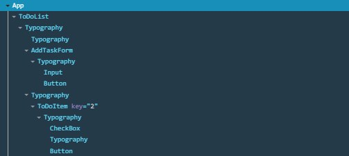
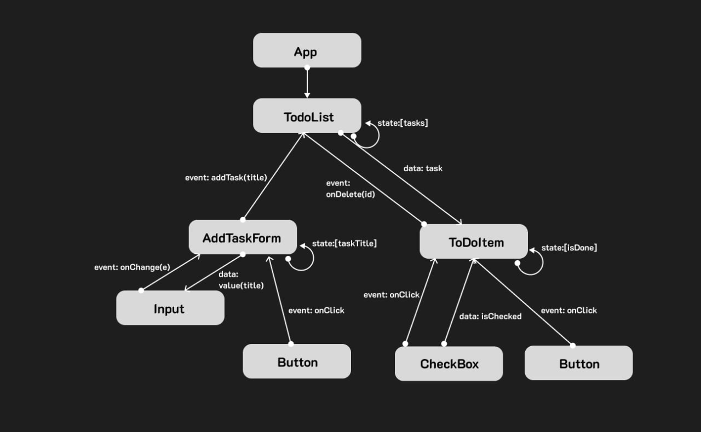

App

TodoList
Props: tasks: Array<Task>, onAddTask(title: string), onToggleDone(id: string), onDelete(id: string)

Events: addTask(title), onDelete(id), onToggleDone(id)

AddTaskForm
Props: onAddTask(title: string) — колбек з TodoList; value: string 

Events: onChange(e) під час введення; onClickAdd()/onSubmit 

Input
Props: value: string 

Events: onChange

Button (Add)
Props: onClick(): void; disabled?: boolean

Events: onClick — onAddTask 

ToDoItem
Props: task: { id: string; title: string; isDone: boolean }, onToggle(id: string), onDelete(id: string); onTitleChange?(id,title)

Events: onClick;

CheckBox
Props: checked: boolean; onChange(e); disabled?: boolean.

Events: onChange

Button (Delete)
Props: onClick(id: string): void

Events: onClick — onDelete(id)
